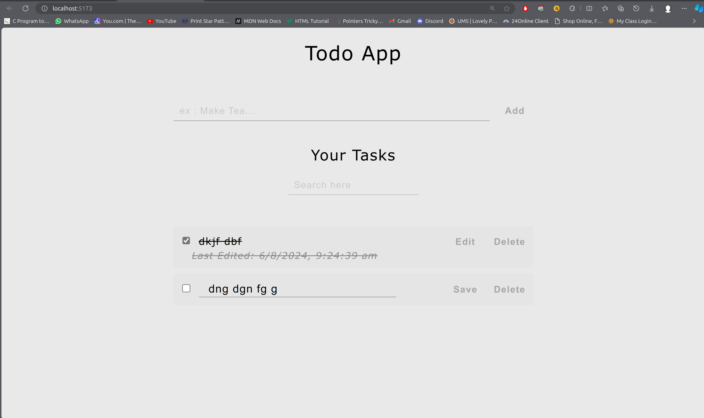

Sure! Adding emojis and interactive stickers can make your README more engaging and visually appealing. Here’s a revised version of your README with added emojis and a more stylish touch:

---

# Todo App 📝

  
_A sleek and modern Todo App built with React and Vite._

## 🚀 Overview

Welcome to the **Todo App**! This application is designed to help you manage your tasks efficiently with a clean, modern interface. It’s built using **React** and **Vite**, ensuring a fast and responsive experience.

## 🌟 Features

- **🆕 Add Tasks**: Quickly add new tasks to your list.
- **✏️ Update Tasks**: Edit your tasks to keep them current.
- **🔍 Search Tasks**: Find tasks easily using the search functionality.
- **✅ Toggle Completion**: Mark tasks as completed or incomplete.
- **🕒 View Last Edited Time**: Track when each task was last modified.
- **📱 Responsive Design**: Enjoy a seamless experience on both desktop and mobile devices.

## 🛠 Tech Stack

- **Frontend**: React, Vite
- **Styling**: CSS (custom)

## 📥 Getting Started

### Prerequisites

Ensure you have **Node.js** and **npm** installed on your machine.

### Installation

1. **Clone the Repository**  
   Clone this repository to your local machine:
   ```bash
   git clone https://github.com/rmnjaat/Todo-App.git
   ```

2. **Navigate to the Project Directory**  
   Move into the project directory:
   ```bash
   cd Todo-App
   ```

3. **Install Dependencies**  
   Install the required dependencies:
   ```bash
   npm install
   ```

### 🚀 Running the App

1. **Start the Development Server**  
   Run the development server:
   ```bash
   npm run dev
   ```

2. **Open the App**  
   Open your browser and go to [http://localhost:3000](http://localhost:5173) to view the app.

### ⚙️ Building for Production

To build the app for production, use:
```bash
npm run build
```
The production-ready files will be located in the `dist` folder.

## 📝 Usage

- **🆕 Adding a Task**: Enter your task in the input field and click "Add" ➕.
- **✏️ Updating a Task**: Click "Edit" ✏️, modify the task, and click "Save" 💾.
- **🔍 Searching Tasks**: Use the search bar 🔍 to filter tasks.
- **✅ Marking as Completed**: Check the box ✅ next to a task to mark it as completed.
- **❌ Deleting a Task**: Click "Delete" 🗑️ to remove a task from the list.

## 🤝 Contributing

Feel free to fork this repository and submit pull requests. All contributions are welcome!

## 📜 License

This project is licensed under the MIT License - see the [LICENSE](LICENSE) file for details.

---

### Screenshot



---

Feel free to adjust the emojis and style to better fit your project and preferences!